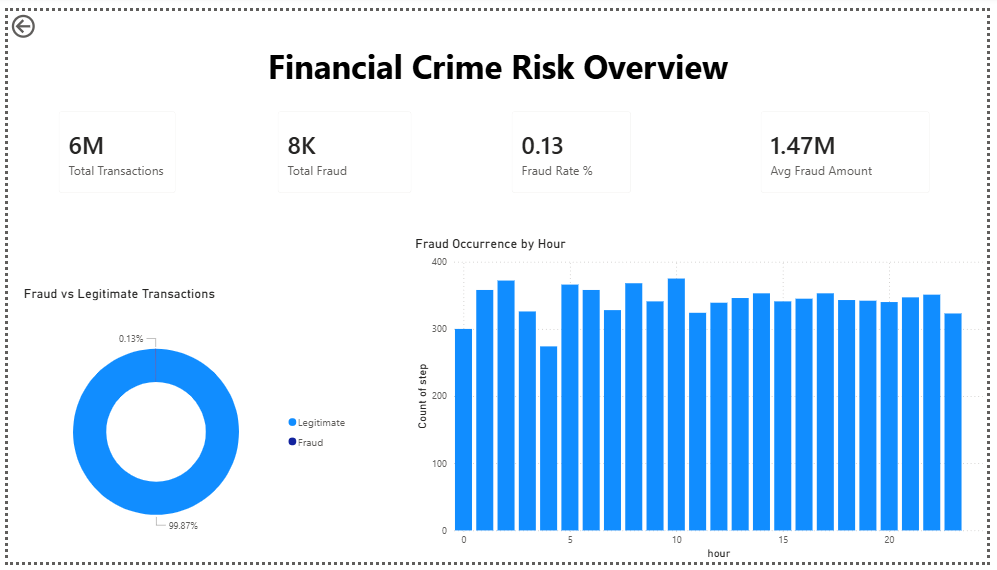

# Financial Fraud Detection Analytics

An end-to-end analytics project built on the PaySim transaction simulation dataset to identify fraud patterns through data engineering, SQL analysis, and business intelligence dashboards.

## 1) Project Overview

This repository demonstrates a practical fraud analytics pipeline:
- ingest raw transaction data
- preprocess and engineer risk indicators in Python
- load processed data into PostgreSQL
- perform fraud-focused SQL analytics
- visualize findings in Power BI dashboards
- prepare for future ML-based fraud prediction with Streamlit

The project emphasizes reproducibility, structured SQL analysis, and insight storytelling.

## 2) Architecture Diagram (Text-Based)

```text
PaySim Dataset (CSV)
        |
        v
Python Cleaning & Feature Engineering
        |
        v
Processed CSV
        |
        v
PostgreSQL Table (transactions)
        |
        v
SQL Fraud Analysis Queries
        |
        v
Power BI Dashboards
        |
        v
Future: Streamlit + ML Fraud Prediction
```

## 3) Dataset Description

- Dataset: PaySim (synthetic mobile money transactions)
- Size: ~6.3 million transactions
- Domain: financial transaction fraud simulation
- Core target field: `isFraud`

PaySim is widely used for fraud analytics because it captures realistic transaction behavior and rare-event fraud patterns.

## 4) Data Preprocessing

Main script: `python/preprocessing.py`

What it does:
- loads raw transactions from `data/raw/raw_transactions.csv`
- derives transaction hour (`step % 24`)
- one-hot encodes transaction type
- removes high-cardinality account identifier columns
- creates high-value transaction flag
- computes balance consistency error metrics
- exports cleaned data to `data/processed/clean_transactions.csv`

Enhancement script: `python/feature_engineering.py`
- adds model-oriented numerical indicators for future supervised learning.

## 5) Database Setup (PostgreSQL)

SQL files:
- `sql/schema.sql` for table creation
- `sql/load_data_psql.md` for local Windows loading instructions via `\copy`

Typical flow:
1. create/select database (`financial_fraud_analysis`)
2. run schema file
3. load processed CSV into `transactions`

## 6) SQL Analysis

Core analytical queries are in `sql/fraud_analysis_queries.sql` and include:
- total transaction and fraud volume
- fraud rate percentage
- fraud by hour
- high-value fraud counts
- fraud concentration by transaction type
- balance anomaly-based fraud signal checks

Detailed interpretation is documented in `sql/query_explanations.md`.

## 7) Power BI Dashboards

Three dashboard views are documented in `dashboards/dashboard_analysis.md`.

### Fraud Overview


### Transaction Patterns


### Risk Indicators


## 8) Key Insights

- Fraud rate is very low overall (around 0.13%), highlighting severe class imbalance.
- Fraud events are primarily concentrated in transfer and cash-out transaction channels.
- Fraud occurrence often clusters in specific hours, enabling time-aware monitoring controls.
- High-value transactions and balance inconsistencies provide strong risk indicators for fraud triage.

## 9) Future Work

- Train and validate ML classifiers (Logistic Regression, Random Forest, XGBoost) on engineered features.
- Add model explainability (feature importance and SHAP-based interpretation).
- Integrate real-time scoring and alert UI through `app/streamlit_app.py`.
- Add model registry and experiment tracking for production-readiness.

## 10) Tech Stack

- Python
- PostgreSQL
- SQL
- Power BI
- Scikit-learn
- Streamlit

## Repository Structure

```text
fraud_detection/
├── app/
│   └── streamlit_app.py
├── dashboards/
│   ├── dashboard_analysis.md
│   ├── overview_dashboard.png
│   ├── risk_indicators_dashboard.png
│   └── transaction_patterns_dashboard.png
├── data/
│   ├── processed/
│   │   └── clean_transactions.csv
│   └── raw/
│       └── raw_transactions.csv
├── models/
│   └── fraud_model.pkl
├── notebooks/
│   └── exploratory_analysis.ipynb
├── python/
│   ├── feature_engineering.py
│   └── preprocessing.py
├── sql/
│   ├── fraud_analysis_queries.sql
│   ├── load_data_psql.md
│   ├── query_explanations.md
│   └── schema.sql
├── .gitignore
├── README.md
└── requirements.txt
```

## Quick Start

```bash
# 1) Install dependencies
pip install -r requirements.txt

# 2) Run preprocessing
python python/preprocessing.py

# 3) (Optional) run feature engineering
python python/feature_engineering.py

# 4) Start Streamlit scaffold
streamlit run app/streamlit_app.py
```
